Instructions for improving the website 

PART 1

1. Move the about me part up to the top, after the stats like  5+ ML models , 10+ projects etc 
2. for the skills that I have part, the icon should be the icon of the framwork not just generic icon like 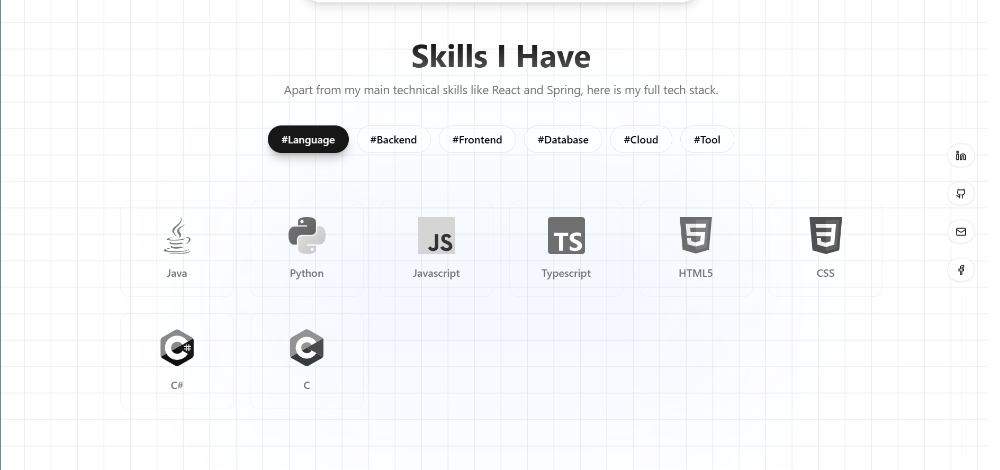 ! 
3.  the name is messed up. Make sure the name resize correctly according to the browser width!
4. Remove generic icons in project I built part.
5. Create a Blog section according to the theme below the Project I built part which have latest blog and appears and button to redirect to the blog page
6. Remove generic icons (the star in the section header? like beside technical expertise, featured works, about me and get in touch)
7. Fix the dark mode. 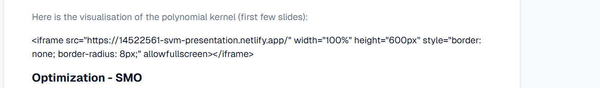 make sure it looks nicer !
8. All ways do Version Control!!!!

Part 2
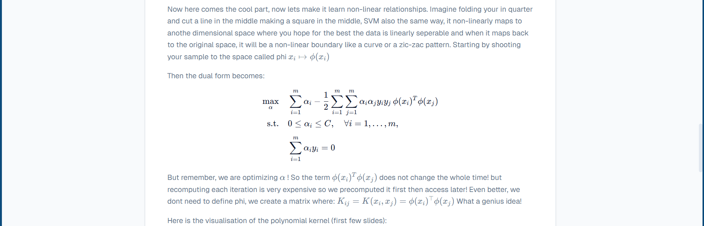
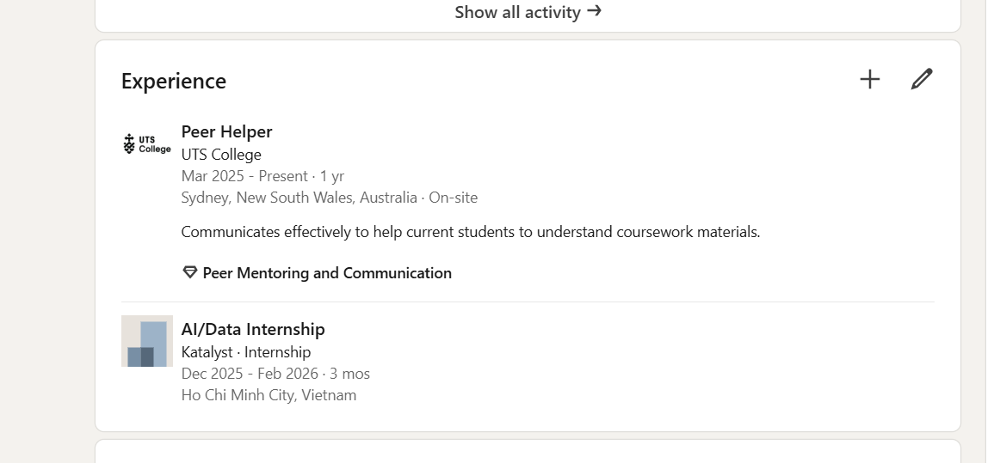
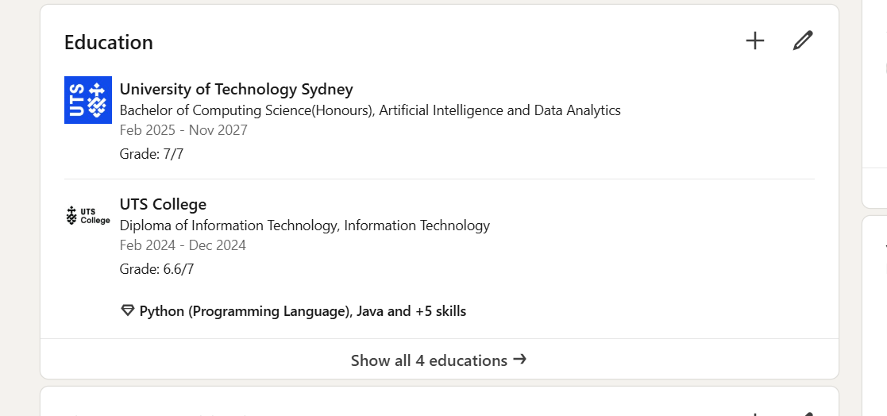
"C:\Users\thanh\Downloads\LINKEDIN PROFILE.jpg" is my linkedin profile picture

1. Now modify the about me section: remove the beyond the code, add my my picture in (bounded in circle like linkedin). Modify the My journey so far so that it match my eductional and experience. Also, modify about me also!
2. My Linkedin profile is https://www.linkedin.com/in/luu-minh-thong-tran-31971b238/ add the redirection to all linkedin link in web
3. My github is https://github.com/LuuMTran Only add redirection do not read and modify the project part
4. My first name is Luu, so I'm Luu not I'm Thong
5. 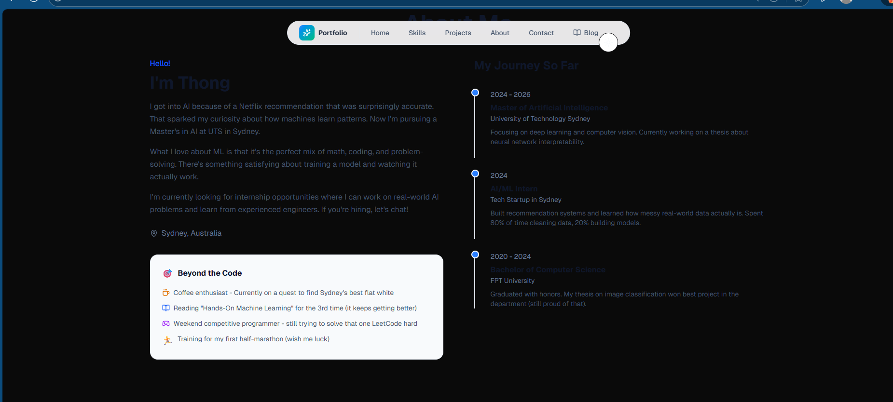 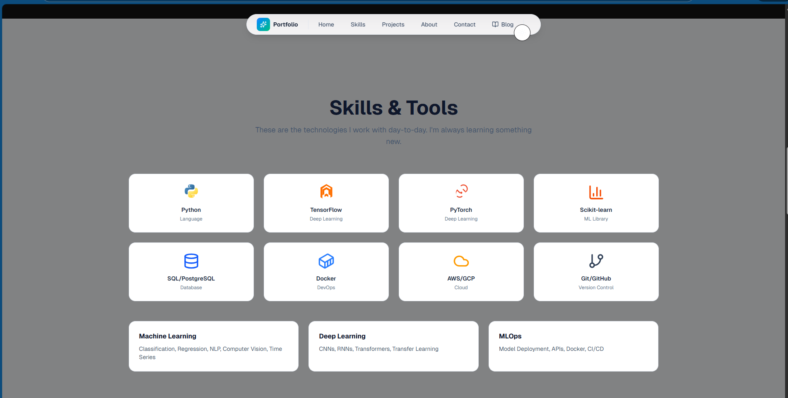 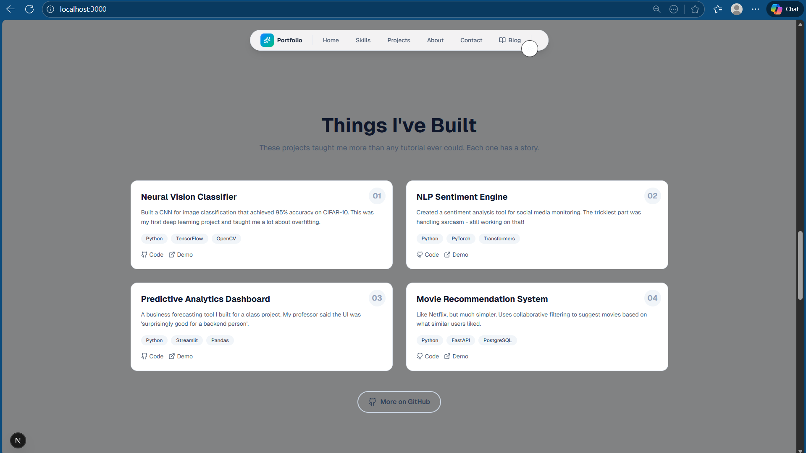 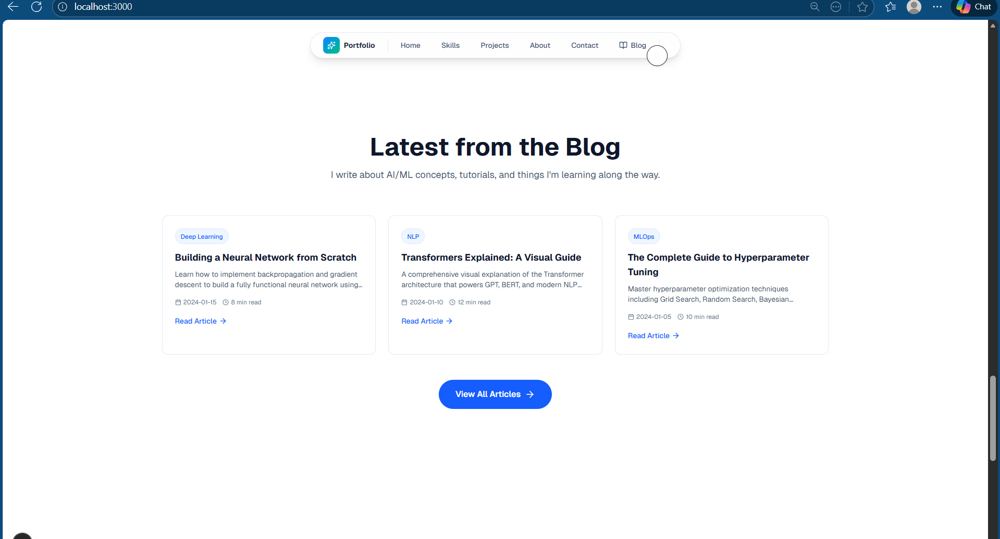 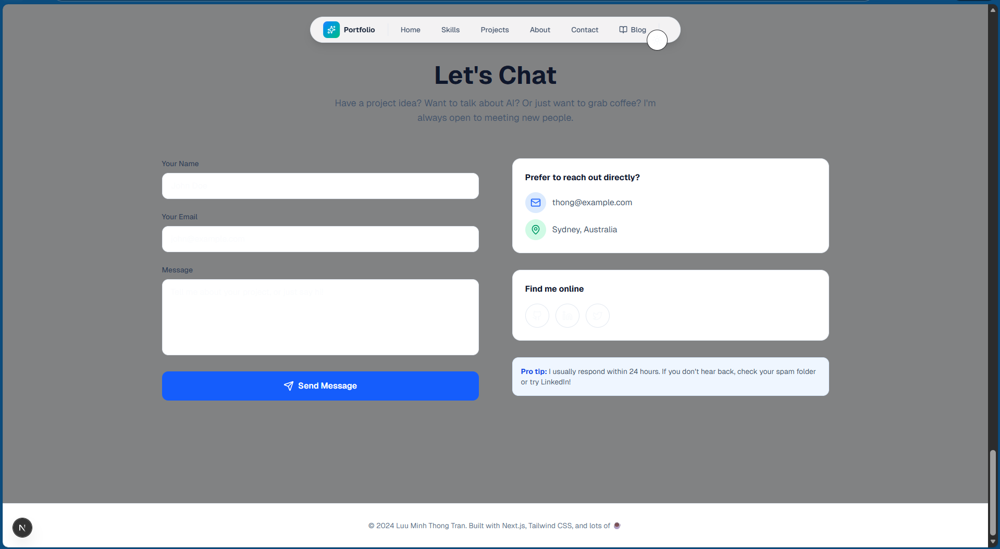 the darkmode is still bad except for about me section, fix the darkmode on other section also, Make sure the words are more visible and bright in darkmode!

Part 2.5 

1. 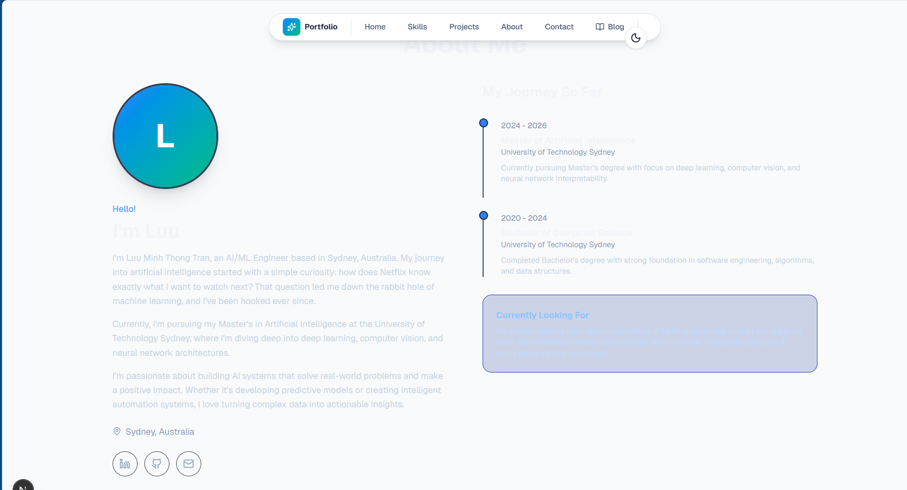 you made the dark mode words brighter but you also made the words in bright mode brights, I cann see anything lighter. I wants the words colors from previous version! 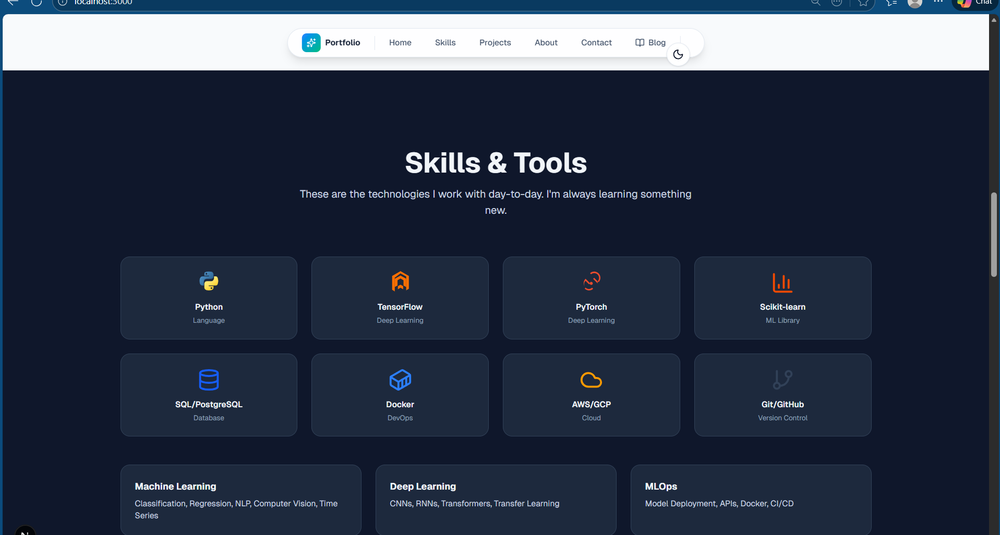 also from skills and tools downward, in bright mode showing dark? I want the one from previous version that is consistent.
2. You missed my experieneces, add it into my journey
3. Add some hover effects on lastest blogs blocks and things I built blocks, make it more repsonsive like skills and tools parts